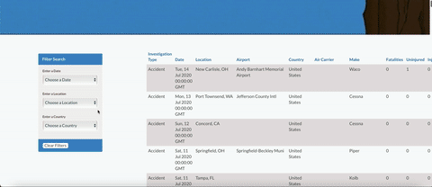

This dashboard includes a bubble map, bar and pie charts, and line graph. Each visualization showcases different data regarding airplane accidents from 1981 to 2021. The bubble map focuses on fatalaties in all accidents, fatalities during commercial flights, and total fatalities at airports in the past 40 years.

We used a combination of Python, JavaScript, Flask apps, SQL, and HTML/CSS for this dashboard.
